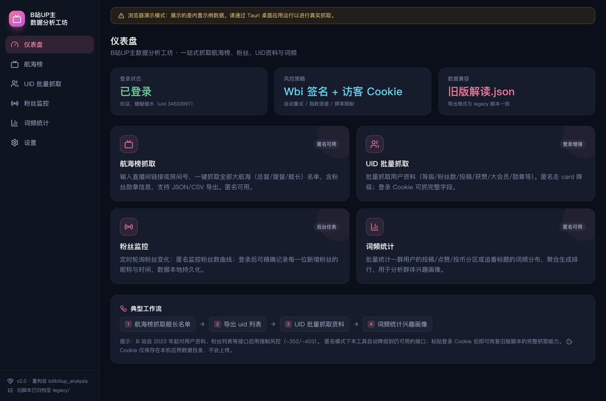
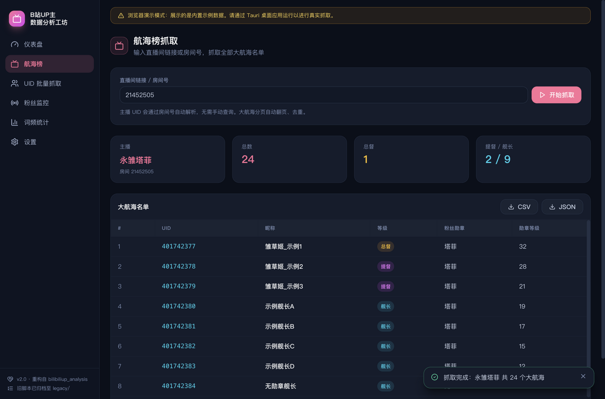
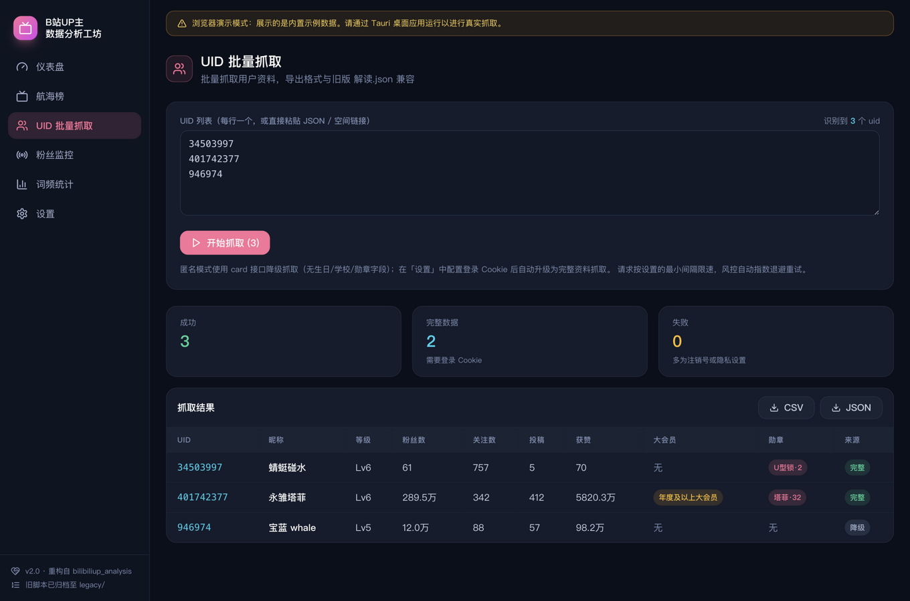
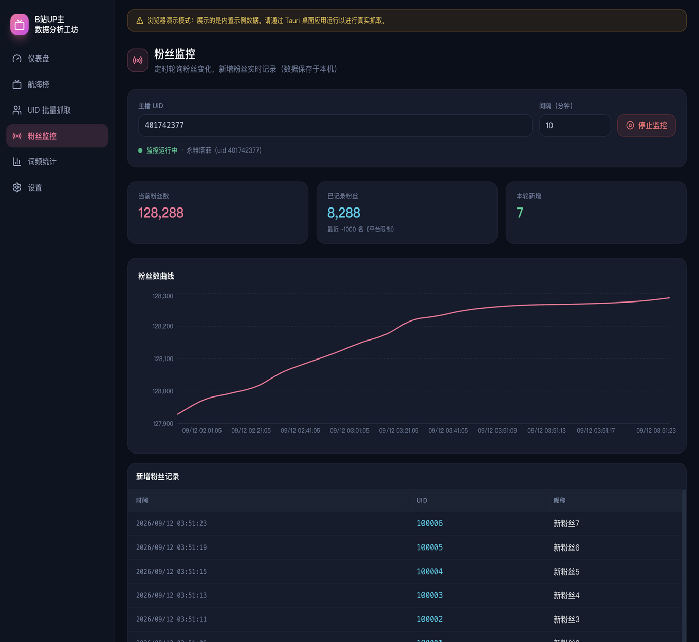
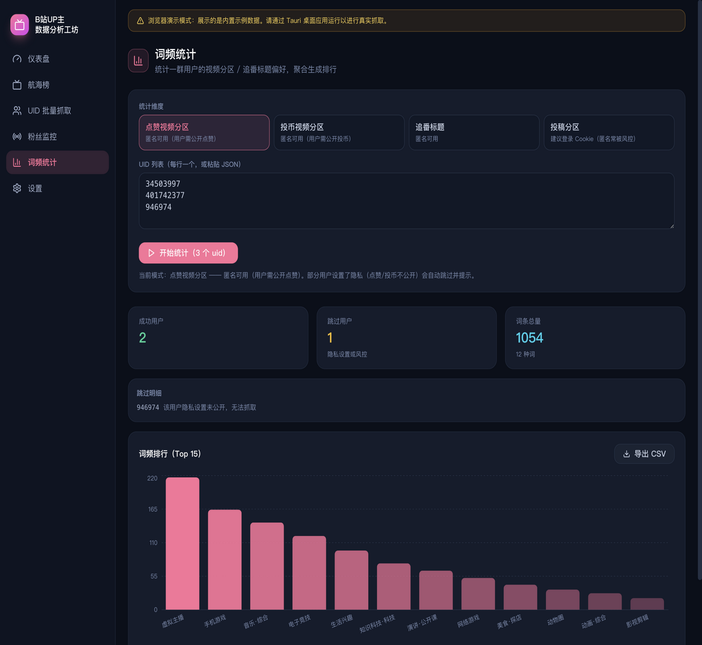

# B站UP主数据分析工坊

一套针对 B 站 UP 主（尤其是主播）的数据分析工具：**抓取航海榜名单、批量抓取用户资料、监控新增粉丝、统计群体兴趣词频**。
v2 起为桌面应用，图形界面操作，无需命令行，支持 Windows / macOS / Linux。

<p align="center">
  
</p>

## 它能做什么

### 🚢 航海榜抓取

粘贴直播间链接或房间号，一键抓取全部大航海（总督 / 提督 / 舰长）名单，包含粉丝勋章信息。
自动翻页、自动去重，主播 UID 无需手动查询。结果可导出 JSON / CSV。

<p>
  
  
</p>

### 👥 UID 批量抓取

把 uid 列表（每行一个，也支持直接粘贴 JSON、空间链接，自动提取数字）批量抓取成资料表：
等级、粉丝数、关注数、投稿数、获赞数、大会员、粉丝勋章等，导出格式与旧版 `解读.json` 完全兼容。

### 📡 粉丝监控

输入主播 UID 后即可挂机监控：定时轮询粉丝变化，实时绘制粉丝数曲线、记录每一位新增粉丝的昵称和时间。
数据保存在本机，关掉应用下次继续累积。

<p>
  
  
</p>

### 📊 词频统计

输入一批 uid（比如从航海榜导出的舰长），统计他们的点赞视频分区 / 投币视频分区 / 追番标题 / 投稿分区的词频分布，
聚合生成排行——用来分析一个粉丝群体的兴趣画像。部分用户隐私未公开的会自动跳过并列出明细。

## 下载安装

前往 [**Releases**](https://github.com/xqingting/bilibiliup_analysis/releases) 下载对应平台的安装包：

| 系统 | 下载文件 | 说明 |
|---|---|---|
| Windows | `*-setup.exe` | NSIS 安装器；首次运行 SmartScreen 可能提示，点「仍要运行」 |
| macOS (Apple Silicon) | `*aarch64.dmg` | M 系列芯片 |
| macOS (Intel) | `*x64.dmg` | Intel 芯片 |
| Linux | `.AppImage` / `.deb` | 主流发行版 |

> **macOS 提示**：应用未做苹果公证，首次打开若提示「无法验证开发者」，请在应用图标上**右键 → 打开**，
> 或在终端执行 `xattr -cr /Applications/bilibiliup-analysis.app` 后再打开。

## 快速上手

1. **航海榜**：在直播间页面复制网址（形如 `https://live.bilibili.com/21452505`），粘贴进输入框点「开始抓取」→ 导出 CSV。
2. **UID 批量**：把抓到的舰长 uid 列表粘贴进来（或任意含数字的文本/JSON），点「开始抓取」→ 结果表可直接导出。
3. **粉丝监控**：填主播 uid、设好轮询间隔（默认 10 分钟），点「开始监控」即可挂机；「停止监控」随时中断。
4. **词频统计**：选好统计维度，粘贴同一批 uid，点「开始统计」看排行，可导出 CSV 继续分析。

## 登录 Cookie（解锁完整数据）

B 站对用户资料、粉丝列表等接口启用强制风控，**未登录时部分数据抓不全**。各功能的可用情况：

| 功能 | 匿名（不登录） | 配置 Cookie 后 |
|---|---|---|
| 航海榜抓取 | ✅ 完整可用 | ✅ |
| UID 批量抓取 | ⚠️ 降级：无生日 / 学校 / 勋章字段 | ✅ 完整字段 |
| 粉丝监控 | ⚠️ 只能看到粉丝数变化曲线 | ✅ 精确记录每位新增粉丝 |
| 词频统计 | ✅ 可用（隐私公开的用户） | ✅ 更稳，解锁投稿分区 |

**获取 Cookie 的步骤**（约 1 分钟）：

1. 电脑浏览器登录 B 站，按 `F12` 打开开发者工具，切到 **Network（网络）** 标签；
2. 刷新页面，在请求列表里随便点一个发往 `api.bilibili.com` 的请求；
3. 在 **Request Headers（请求标头）** 里找到 `Cookie:`，右键复制**整段值**（需包含 `SESSDATA=…`）；
4. 粘贴到本应用「设置」页的输入框，点「保存并检测登录态」，显示绿色「有效」即成功。

隐私说明：Cookie 只保存在**本机**应用数据目录（`settings.json`），不上传到任何服务器；
建议使用小号；在 B 站账号安全设置里退出登录可随时使其失效。

## 常见问题

<details>
<summary><b>抓取时报「需要登录Cookie」/-352/-403 是什么意思？</b></summary>

这是 B 站服务端的风控拦截，不是软件坏了。按上一节配置 Cookie 即可；匿名模式下软件会自动降级到仍可用的接口，能抓多少抓多少，并在结果里标注「完整 / 降级」来源。
</details>

<details>
<summary><b>粉丝监控只能看到最近约 1000 个粉丝？</b></summary>

是平台限制：B 站粉丝列表接口只暴露最近约 1000 名，任何工具都一样。粉丝**数量**曲线不受影响，一直准确。
</details>

<details>
<summary><b>词频统计有个别 uid 被跳过？</b></summary>

对方把点赞 / 投币设置成了隐私（或账号注销），任何人都看不到，软件会列出跳过明细后继续处理其余用户。
</details>

<details>
<summary><b>抓取频繁失败 / 被风控？</b></summary>

到「设置」里把「请求最小间隔」调大到 800–1500 毫秒，稍等几分钟再试。软件已内置自动重试与访客 Cookie 轮换，一般无需干预。
</details>

<details>
<summary><b>旧版脚本（.py / .js / .exe）还能用吗？</b></summary>

已整体归档到 [`legacy/`](legacy/) 目录，原样保留可独立运行，但受 B 站风控影响功能受限，建议改用本应用。
</details>

## 从旧版升级

- 旧版导出的 `解读.json`、uid 列表文件可直接导入本应用继续处理，导出格式保持兼容；
- 旧脚本的全部能力（航海榜 / 粉丝监控 / UID 批量 / 词频）均已覆盖并增强。

## 开发与构建

面向开发者的技术细节（代码结构、Wbi 签名与风控适配说明、旧接口实测数据、本地构建命令）见
[docs/DEVELOPMENT.md](docs/DEVELOPMENT.md)。简而言之：

```bash
cd app && pnpm install && pnpm tauri build   # 构建本机安装包
```

## License

MIT
